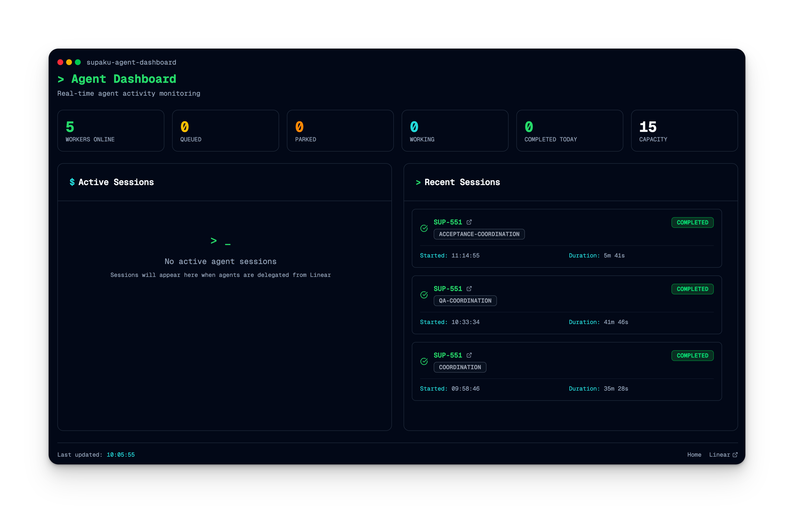

# Supaku AgentFactory

**The open-source software factory — multi-agent fleet management for coding agents.**

AgentFactory turns your issue backlog into shipped code. It orchestrates a fleet of coding agents (Claude, Codex, Amp) through an automated pipeline: development, QA, and acceptance — like an assembly line for software.

<p align="center">
  
</p>

## The Software Factory

| Factory Concept | AgentFactory Equivalent |
|----------------|------------------------|
| Assembly line | Issue backlog → Started → Finished → Delivered → Accepted |
| Work orders | Issues with requirements |
| Factory workers | Coding agents (Claude, Codex, Amp) |
| Work stations | Work types: development, QA, acceptance |
| Floor manager | Orchestrator — dispatches, monitors, recovers |
| Shift workers | Distributed worker pool (Redis-coordinated) |
| Quality control | QA agents that validate work before promotion |
| Factory floor | Git worktrees — isolated workspaces per agent |
| Time clock | Heartbeat + inactivity timeout |
| Incident reports | Crash recovery + session resume |
| Cost accounting | Per-session token/cost tracking |

## Packages

| Package | npm | Description |
|---------|-----|-------------|
| **[@supaku/agentfactory](./packages/core)** | `@supaku/agentfactory` | Core orchestrator, provider abstraction, crash recovery |
| **[@supaku/agentfactory-linear](./packages/linear)** | `@supaku/agentfactory-linear` | Linear issue tracker integration |
| **[@supaku/agentfactory-server](./packages/server)** | `@supaku/agentfactory-server` | Redis work queue, session storage, worker pool |
| **[@supaku/agentfactory-cli](./packages/cli)** | `@supaku/agentfactory-cli` | CLI tools for local orchestrator and remote workers |

## Quick Start

```bash
# Install the core package
npm install @supaku/agentfactory @supaku/agentfactory-linear

# Set up your environment
export LINEAR_API_KEY=lin_api_...
export AGENT_PROVIDER=claude  # or codex, amp
```

### Spawn an agent on a single issue

```typescript
import { createOrchestrator } from '@supaku/agentfactory'

const orchestrator = createOrchestrator({
  maxConcurrent: 3,
  worktreePath: '.worktrees',
})

// Process a single issue
await orchestrator.spawnAgentForIssue('PROJ-123')
await orchestrator.waitForAll()
```

### Process your entire backlog

```typescript
const orchestrator = createOrchestrator({
  project: 'MyProject',
  maxConcurrent: 3,
})

const result = await orchestrator.run()
console.log(`Spawned ${result.agents.length} agents`)

await orchestrator.waitForAll()
```

### Use the CLI

```bash
# Process backlog issues from a project
npx af-orchestrator --project MyProject --max 3

# Process a single issue
npx af-orchestrator --single PROJ-123

# Preview what would be processed
npx af-orchestrator --project MyProject --dry-run
```

## Architecture

```
┌─────────────────────────────────────────────────┐
│                  Orchestrator                     │
│  ┌───────────┐  ┌───────────┐  ┌───────────┐   │
│  │  Agent 1   │  │  Agent 2   │  │  Agent 3   │   │
│  │ (Claude)   │  │ (Codex)    │  │ (Claude)   │   │
│  │ DEV: #123  │  │ QA: #120   │  │ DEV: #125  │   │
│  └─────┬─────┘  └─────┬─────┘  └─────┬─────┘   │
│        │              │              │           │
│  ┌─────┴─────┐  ┌─────┴─────┐  ┌─────┴─────┐   │
│  │ Worktree   │  │ Worktree   │  │ Worktree   │   │
│  │ .wt/#123   │  │ .wt/#120   │  │ .wt/#125   │   │
│  └───────────┘  └───────────┘  └───────────┘   │
└─────────────────────────────────────────────────┘
         │                    │
    ┌────┴────┐         ┌────┴────┐
    │ Linear  │         │  Git    │
    │  API    │         │  Repo   │
    └─────────┘         └─────────┘
```

### Provider Abstraction

AgentFactory supports multiple coding agent providers through a unified interface:

```typescript
interface AgentProvider {
  readonly name: 'claude' | 'codex' | 'amp'
  spawn(config: AgentSpawnConfig): AgentHandle
  resume(sessionId: string, config: AgentSpawnConfig): AgentHandle
}

interface AgentHandle {
  sessionId: string | null
  stream: AsyncIterable<AgentEvent>
  injectMessage(text: string): Promise<void>
  stop(): Promise<void>
}
```

Provider is selected via environment variables:

```bash
AGENT_PROVIDER=claude            # Global default
AGENT_PROVIDER_QA=codex          # Per-work-type override
AGENT_PROVIDER_SOCIAL=amp        # Per-project override
```

### Work Types

Issues flow through work stations based on their status:

| Status | Work Type | Agent Role |
|--------|-----------|------------|
| Backlog | `development` | Implement the feature/fix |
| Started | `inflight` | Continue in-progress work |
| Finished | `qa` | Validate implementation |
| Delivered | `acceptance` | Final acceptance testing |
| Rejected | `refinement` | Address feedback |

### Crash Recovery

AgentFactory includes built-in crash recovery:

1. **Heartbeat monitoring** — agents send periodic health signals
2. **State persistence** — session state saved to `.agent/` directory
3. **Automatic resume** — crashed agents are detected and restarted
4. **Recovery limits** — configurable max recovery attempts

### Inactivity Timeout

Agents are monitored for inactivity:

```typescript
const orchestrator = createOrchestrator({
  inactivityTimeoutMs: 300000,    // 5 minutes default
  maxSessionTimeoutMs: 7200000,   // 2 hour hard cap
  workTypeTimeouts: {
    qa: { inactivityTimeoutMs: 600000 },  // QA gets 10 min
  },
})
```

## Distributed Workers

For teams that need horizontal scaling, AgentFactory supports a distributed worker pool:

```
┌────────────────┐     ┌─────────┐     ┌────────────────┐
│  Webhook Server │────▶│  Redis  │◀────│  Worker Node 1  │
│  (receives      │     │  Queue  │     │  (claims work)  │
│   issues)       │     │         │     └────────────────┘
└────────────────┘     │         │     ┌────────────────┐
                       │         │◀────│  Worker Node 2  │
                       │         │     │  (claims work)  │
                       └─────────┘     └────────────────┘
```

This requires the `@supaku/agentfactory-server` package and a Redis instance.

## Configuration

### Environment Variables

| Variable | Required | Description |
|----------|----------|-------------|
| `LINEAR_API_KEY` | Yes | Linear API key for issue management |
| `AGENT_PROVIDER` | No | Default provider: `claude`, `codex`, `amp` (default: `claude`) |
| `LINEAR_TEAM_ID` | No | Linear team UUID |
| `REDIS_URL` | For distributed | Redis connection URL |

### Orchestrator Config

```typescript
interface OrchestratorConfig {
  provider?: AgentProvider           // Agent provider instance
  maxConcurrent?: number             // Max concurrent agents (default: 3)
  project?: string                   // Project name filter
  worktreePath?: string              // Git worktree base path (default: .worktrees)
  linearApiKey?: string              // Linear API key
  autoTransition?: boolean           // Auto-update issue status (default: true)
  sandboxEnabled?: boolean           // Enable agent sandboxing (default: false)
  inactivityTimeoutMs?: number       // Inactivity timeout (default: 300000)
  maxSessionTimeoutMs?: number       // Hard session cap
  workTypeTimeouts?: Record<string, WorkTypeTimeoutConfig>
}
```

## Linear Integration

The `@supaku/agentfactory-linear` package provides:

- **Agent sessions** — lifecycle management with status transitions
- **Activity streaming** — thoughts, actions, and responses visible in Linear
- **Plan tracking** — task checklists with progress states
- **Work routing** — automatic work type detection from issue status
- **Sub-issue coordination** — dependency-aware parallel execution

```typescript
import { createLinearAgentClient, createAgentSession } from '@supaku/agentfactory-linear'

const client = createLinearAgentClient({ apiKey: process.env.LINEAR_API_KEY! })
const session = createAgentSession({
  client: client.linearClient,
  issueId: 'issue-uuid',
  autoTransition: true,
  workType: 'development',
})

await session.start()
await session.emitThought('Analyzing requirements...')
await session.complete('Feature implemented with tests')
```

## Agent Definitions

Agent definitions tell coding agents how to behave at each stage of the pipeline. See [examples/agent-definitions](./examples/agent-definitions) for ready-to-use templates:

| Definition | Stage | What it does |
|-----------|-------|-------------|
| [developer.md](./examples/agent-definitions/developer.md) | Development | Implements features, fixes bugs, creates PRs |
| [qa-reviewer.md](./examples/agent-definitions/qa-reviewer.md) | QA | Validates implementation, runs tests |
| [coordinator.md](./examples/agent-definitions/coordinator.md) | Coordination | Orchestrates parallel sub-issues |
| [acceptance-handler.md](./examples/agent-definitions/acceptance-handler.md) | Acceptance | Validates, merges PRs, cleans up |
| [backlog-writer.md](./examples/agent-definitions/backlog-writer.md) | Planning | Transforms plans into Linear issues |

Place your definitions in `.claude/agents/` at the root of your repository. Customize them for your stack — add your test commands, framework patterns, and deployment checks.

## Development

```bash
# Install dependencies
pnpm install

# Build all packages
pnpm build

# Run type checking
pnpm typecheck

# Run tests
pnpm test
```

## License

MIT - see [LICENSE](./LICENSE)

---

Built by [Supaku](https://supaku.com)
