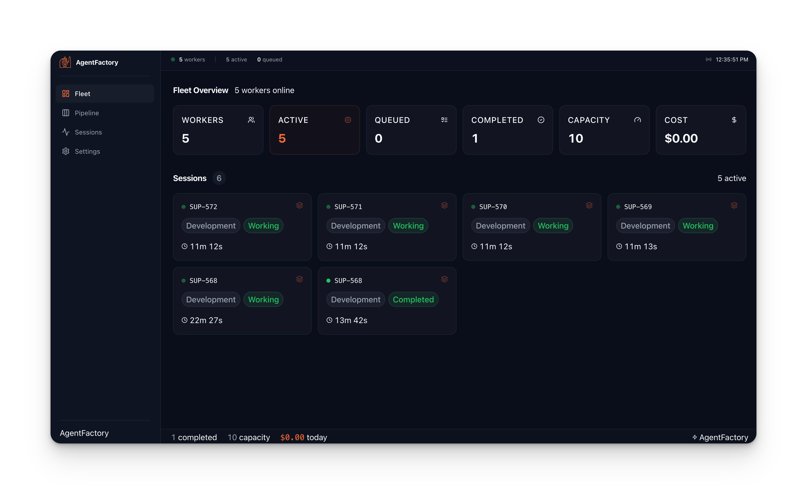
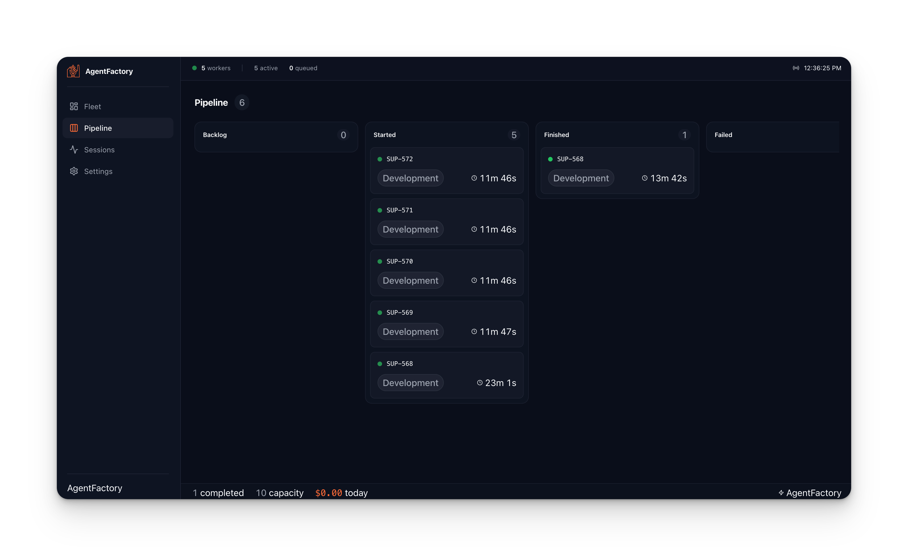
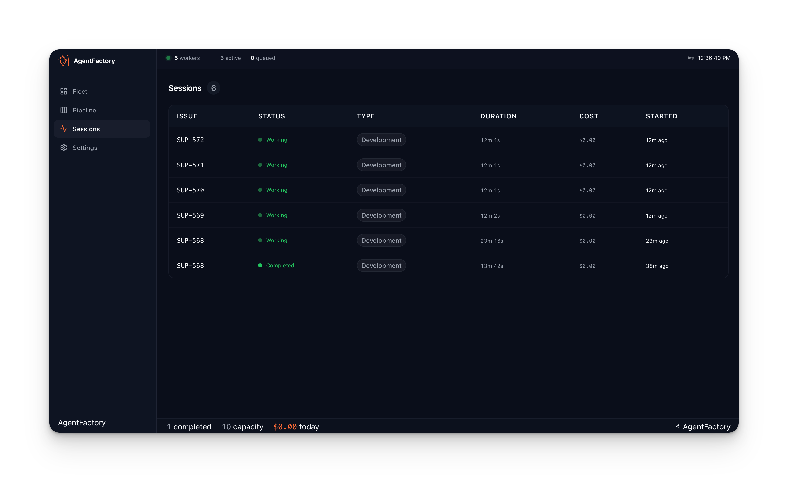
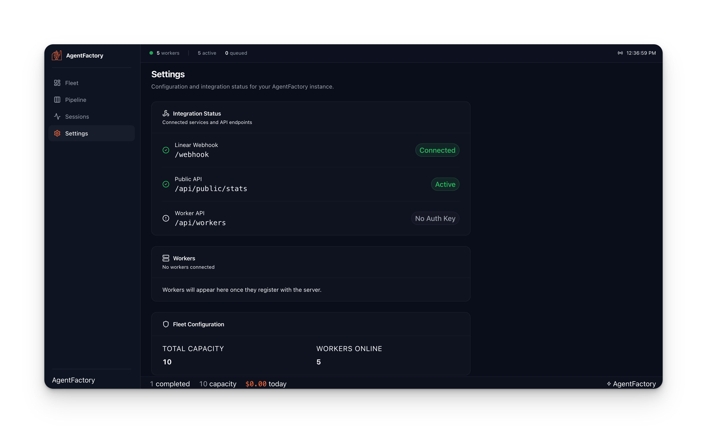

# Supaku AgentFactory

[](https://www.npmjs.com/package/@supaku/agentfactory)
[](https://opensource.org/licenses/MIT)
[](https://www.typescriptlang.org/)
[](https://linear.app)
[](https://github.com/supaku/agentfactory)

**The open-source software factory — multi-agent fleet management for coding agents.**

AgentFactory turns your issue backlog into shipped code. It orchestrates a fleet of coding agents (Claude, Codex, Amp) through an automated pipeline: development, QA, and acceptance — like an assembly line for software.

### Fleet Overview

Real-time view of your agent fleet. Track worker count, active/queued sessions, completed work, available capacity, and total cost at a glance. Each agent card shows the issue it's working on, work type, status, duration, and cost — click any card to jump to its session detail.

<p align="center">
  
</p>

### Pipeline

Kanban-style board that groups sessions by stage: Backlog, Started, Finished, Failed, and Stopped. Visualize where work is flowing and where it's stuck across your entire factory.

<p align="center">
  
</p>

### Sessions

Sortable table of every agent session with issue identifier, status, work type, duration, cost, and start time. Click any row to drill into the full session timeline with token usage and event history.

<p align="center">
  
</p>

### Settings

Configuration and integration health at a glance. Shows connection status for the Linear webhook, public API, and worker API endpoints, lists connected workers, and displays fleet capacity.

<p align="center">
  
</p>

## The Software Factory

| Factory Concept | AgentFactory Equivalent |
|----------------|------------------------|
| Assembly line | Issue backlog → Started → Finished → Delivered → Accepted |
| Work orders | Issues with requirements |
| Factory workers | Coding agents (Claude, Codex, Amp) |
| Work stations | Work types: development, QA, acceptance |
| Floor manager | Orchestrator — dispatches, monitors, recovers |
| Shift workers | Distributed worker pool (Redis-coordinated) |
| Quality control | QA agents that validate work before promotion |
| Factory floor | Git worktrees — isolated workspaces per agent |
| Time clock | Heartbeat + inactivity timeout |
| Incident reports | Crash recovery + session resume |
| Cost accounting | Per-session token/cost tracking |

## Packages

| Package | npm | Description |
|---------|-----|-------------|
| **[@supaku/agentfactory](./packages/core)** | `@supaku/agentfactory` | Core orchestrator, provider abstraction, crash recovery |
| **[@supaku/agentfactory-linear](./packages/linear)** | `@supaku/agentfactory-linear` | Linear issue tracker integration |
| **[@supaku/agentfactory-server](./packages/server)** | `@supaku/agentfactory-server` | Redis work queue, session storage, worker pool |
| **[@supaku/agentfactory-cli](./packages/cli)** | `@supaku/agentfactory-cli` | CLI tools for local orchestrator and remote workers |
| **[@supaku/agentfactory-nextjs](./packages/nextjs)** | `@supaku/agentfactory-nextjs` | Next.js route handlers, webhook processor, middleware |
| **[@supaku/create-agentfactory-app](./packages/create-app)** | `@supaku/create-agentfactory-app` | Project scaffolding tool |

## Quick Start

### Create a new project (recommended)

```bash
npx @supaku/create-agentfactory-app my-agent

cd my-agent
cp .env.example .env.local    # Fill in LINEAR_ACCESS_TOKEN
pnpm install && pnpm dev      # Start webhook server
pnpm worker                   # Start local worker (in another terminal)
```

### Webhook Server (Next.js)

For production use, AgentFactory provides a webhook server that receives Linear events and dispatches agents:

```typescript
// src/lib/config.ts
import { createAllRoutes, createDefaultLinearClientResolver } from '@supaku/agentfactory-nextjs'

export const routes = createAllRoutes({
  linearClient: createDefaultLinearClientResolver(),
})
```

```typescript
// src/app/webhook/route.ts
import { routes } from '@/lib/config'
export const POST = routes.webhook.POST
export const GET = routes.webhook.GET
```

### Spawn an agent on a single issue

```typescript
import { createOrchestrator } from '@supaku/agentfactory'

const orchestrator = createOrchestrator({
  maxConcurrent: 3,
  worktreePath: '.worktrees',
})

// Process a single issue
await orchestrator.spawnAgentForIssue('PROJ-123')
await orchestrator.waitForAll()
```

### Process your entire backlog

```typescript
const orchestrator = createOrchestrator({
  project: 'MyProject',
  maxConcurrent: 3,
})

const result = await orchestrator.run()
console.log(`Spawned ${result.agents.length} agents`)

await orchestrator.waitForAll()
```

### Use the CLI

```bash
# Process backlog issues from a project
npx af-orchestrator --project MyProject --max 3

# Process a single issue
npx af-orchestrator --single PROJ-123

# Preview what would be processed
npx af-orchestrator --project MyProject --dry-run
```

## Architecture

```
┌─────────────────────────────────────────────────┐
│                  Orchestrator                     │
│  ┌───────────┐  ┌───────────┐  ┌───────────┐   │
│  │  Agent 1   │  │  Agent 2   │  │  Agent 3   │   │
│  │ (Claude)   │  │ (Codex)    │  │ (Claude)   │   │
│  │ DEV: #123  │  │ QA: #120   │  │ DEV: #125  │   │
│  └─────┬─────┘  └─────┬─────┘  └─────┬─────┘   │
│        │              │              │           │
│  ┌─────┴─────┐  ┌─────┴─────┐  ┌─────┴─────┐   │
│  │ Worktree   │  │ Worktree   │  │ Worktree   │   │
│  │ .wt/#123   │  │ .wt/#120   │  │ .wt/#125   │   │
│  └───────────┘  └───────────┘  └───────────┘   │
└─────────────────────────────────────────────────┘
         │                    │
    ┌────┴────┐         ┌────┴────┐
    │ Linear  │         │  Git    │
    │  API    │         │  Repo   │
    └─────────┘         └─────────┘
```

### Provider Abstraction

AgentFactory supports multiple coding agent providers through a unified interface:

```typescript
interface AgentProvider {
  readonly name: 'claude' | 'codex' | 'amp'
  spawn(config: AgentSpawnConfig): AgentHandle
  resume(sessionId: string, config: AgentSpawnConfig): AgentHandle
}

interface AgentHandle {
  sessionId: string | null
  stream: AsyncIterable<AgentEvent>
  injectMessage(text: string): Promise<void>
  stop(): Promise<void>
}
```

Provider is selected via environment variables:

```bash
AGENT_PROVIDER=claude            # Global default
AGENT_PROVIDER_QA=codex          # Per-work-type override
AGENT_PROVIDER_SOCIAL=amp        # Per-project override
```

### Work Types

Issues flow through work stations based on their status:

| Status | Work Type | Agent Role |
|--------|-----------|------------|
| Backlog | `development` | Implement the feature/fix |
| Started | `inflight` | Continue in-progress work |
| Finished | `qa` | Validate implementation |
| Delivered | `acceptance` | Final acceptance testing |
| Rejected | `refinement` | Address feedback |

### Crash Recovery

AgentFactory includes built-in crash recovery:

1. **Heartbeat monitoring** — agents send periodic health signals
2. **State persistence** — session state saved to `.agent/` directory
3. **Automatic resume** — crashed agents are detected and restarted
4. **Recovery limits** — configurable max recovery attempts

### Inactivity Timeout

Agents are monitored for inactivity:

```typescript
const orchestrator = createOrchestrator({
  inactivityTimeoutMs: 300000,    // 5 minutes default
  maxSessionTimeoutMs: 7200000,   // 2 hour hard cap
  workTypeTimeouts: {
    qa: { inactivityTimeoutMs: 600000 },  // QA gets 10 min
  },
})
```

## Distributed Workers

For teams that need horizontal scaling, AgentFactory supports a distributed worker pool:

```
┌────────────────┐     ┌─────────┐     ┌────────────────┐
│  Webhook Server │────▶│  Redis  │◀────│  Worker Node 1  │
│  (receives      │     │  Queue  │     │  (claims work)  │
│   issues)       │     │         │     └────────────────┘
└────────────────┘     │         │     ┌────────────────┐
                       │         │◀────│  Worker Node 2  │
                       │         │     │  (claims work)  │
                       └─────────┘     └────────────────┘
```

This requires the `@supaku/agentfactory-server` package and a Redis instance.

## Configuration

### Environment Variables

| Variable | Required | Description |
|----------|----------|-------------|
| `LINEAR_ACCESS_TOKEN` | Yes | Linear API key (used by Next.js webhook server) |
| `LINEAR_API_KEY` | Yes | Linear API key (used by CLI tools) |
| `AGENT_PROVIDER` | No | Default provider: `claude`, `codex`, `amp` (default: `claude`) |
| `LINEAR_TEAM_ID` | No | Linear team UUID |
| `REDIS_URL` | For distributed | Redis connection URL |

> **Note:** Set both `LINEAR_ACCESS_TOKEN` and `LINEAR_API_KEY` to the same value, or see [Configuration](./docs/configuration.md) for details.

### Orchestrator Config

```typescript
interface OrchestratorConfig {
  provider?: AgentProvider           // Agent provider instance
  maxConcurrent?: number             // Max concurrent agents (default: 3)
  project?: string                   // Project name filter
  worktreePath?: string              // Git worktree base path (default: .worktrees)
  linearApiKey?: string              // Linear API key
  autoTransition?: boolean           // Auto-update issue status (default: true)
  sandboxEnabled?: boolean           // Enable agent sandboxing (default: false)
  inactivityTimeoutMs?: number       // Inactivity timeout (default: 300000)
  maxSessionTimeoutMs?: number       // Hard session cap
  workTypeTimeouts?: Record<string, WorkTypeTimeoutConfig>
}
```

## Linear Integration

The `@supaku/agentfactory-linear` package provides:

- **Agent sessions** — lifecycle management with status transitions
- **Activity streaming** — thoughts, actions, and responses visible in Linear
- **Plan tracking** — task checklists with progress states
- **Work routing** — automatic work type detection from issue status
- **Sub-issue coordination** — dependency-aware parallel execution

```typescript
import { createLinearAgentClient, createAgentSession } from '@supaku/agentfactory-linear'

const client = createLinearAgentClient({ apiKey: process.env.LINEAR_API_KEY! })
const session = createAgentSession({
  client: client.linearClient,
  issueId: 'issue-uuid',
  autoTransition: true,
  workType: 'development',
})

await session.start()
await session.emitThought('Analyzing requirements...')
await session.complete('Feature implemented with tests')
```

### Setting Up Linear

**1. Create a Linear API Key**

Go to [Linear Settings > API](https://linear.app/settings/api) and create a **Personal API Key** (starts with `lin_api_`).

**2. Configure the Webhook**

In Linear Settings > API > Webhooks, create a webhook:

- **URL:** `https://your-app.example.com/webhook`
- **Events to subscribe:** `AgentSession` (created, updated, prompted) and `Issue` (updated)
- Copy the **Signing Secret** — this is your `LINEAR_WEBHOOK_SECRET`

The webhook signature is verified using HMAC-SHA256 via the `linear-signature` header. Verification is enforced in production and optional in development.

**3. Set Environment Variables**

| Variable | Required | Description |
|----------|----------|-------------|
| `LINEAR_ACCESS_TOKEN` | Yes | API key for the Next.js webhook server |
| `LINEAR_API_KEY` | Yes | API key for CLI tools (can be the same value as above) |
| `LINEAR_WEBHOOK_SECRET` | Production | Signing secret from your Linear webhook |
| `LINEAR_CLIENT_ID` | No | OAuth app client ID (multi-workspace only) |
| `LINEAR_CLIENT_SECRET` | No | OAuth app client secret (multi-workspace only) |
| `NEXT_PUBLIC_APP_URL` | No | App URL for OAuth redirects (default: `http://localhost:3000`) |
| `REDIS_URL` | Distributed mode | Redis connection URL for worker pool and OAuth token storage |

> **Tip:** `LINEAR_ACCESS_TOKEN` and `LINEAR_API_KEY` can be the same key. The server uses `LINEAR_ACCESS_TOKEN`; CLI tools use `LINEAR_API_KEY`.

For the full environment variable reference and OAuth setup, see the [Getting Started guide](./docs/getting-started.md) and [Configuration reference](./docs/configuration.md).

## Agent Definitions

Agent definitions tell coding agents how to behave at each stage of the pipeline. See [examples/agent-definitions](./examples/agent-definitions) for ready-to-use templates:

| Definition | Stage | What it does |
|-----------|-------|-------------|
| [developer.md](./examples/agent-definitions/developer.md) | Development | Implements features, fixes bugs, creates PRs |
| [qa-reviewer.md](./examples/agent-definitions/qa-reviewer.md) | QA | Validates implementation, runs tests |
| [coordinator.md](./examples/agent-definitions/coordinator.md) | Coordination | Orchestrates parallel sub-issues |
| [acceptance-handler.md](./examples/agent-definitions/acceptance-handler.md) | Acceptance | Validates, merges PRs, cleans up |
| [backlog-writer.md](./examples/agent-definitions/backlog-writer.md) | Planning | Transforms plans into Linear issues |

Place your definitions in `.claude/agents/` at the root of your repository. Customize them for your stack — add your test commands, framework patterns, and deployment checks.

## Development

```bash
# Install dependencies
pnpm install

# Build all packages
pnpm build

# Run type checking
pnpm typecheck

# Run tests
pnpm test
```

## Built with AgentFactory

AgentFactory powers real products in production:

| Product | What it does |
|---------|-------------|
| [Supaku Social](https://supaku.com/products/social) | AI-powered social media management |
| [Supaku Art](https://art.supaku.com) | Art collection curation platform |
| [Supaku Account](https://account.supaku.com) | Unified auth across the Supaku ecosystem |

Building with AgentFactory? Add the badge to your project and [share it in Discussions](https://github.com/supaku/agentfactory/discussions).

## Badge

If you're building with AgentFactory, add the badge to your README:

<!-- Dark badge (default) -->
[](https://github.com/supaku/agentfactory)

<!-- Light badge (for dark READMEs) -->
[](https://github.com/supaku/agentfactory)

Or use HTML for GitHub theme-switching (auto light/dark):

```html
<a href="https://github.com/supaku/agentfactory">
  <picture>
    <source media="(prefers-color-scheme: dark)" srcset="https://raw.githubusercontent.com/supaku/agentfactory/main/docs/assets/badge-built-with-dark.svg">
    <source media="(prefers-color-scheme: light)" srcset="https://raw.githubusercontent.com/supaku/agentfactory/main/docs/assets/badge-built-with-light.svg">
    
  </picture>
</a>
```

## License

MIT - see [LICENSE](./LICENSE)

---

Built by [Supaku](https://supaku.com)
